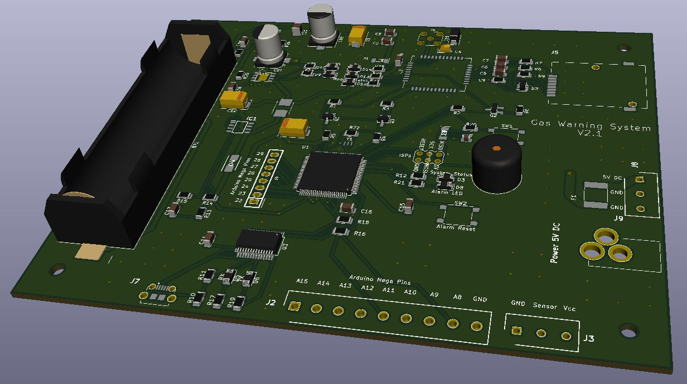

# Project Name
> Gas Warning System

## Table of contents
* [General info](#general-info)
* [Screenshots](#screenshots)
* [Technologies](#technologies)
* [Setup](#setup)
* [Features](#features)
* [Status](#status)
* [Inspiration](#inspiration)
* [Parts and footprints list](#Parts-and-footprints-list)
* [Allowed (planned) SMS commands](#Allowed-(planned)-SMS-commands)
* [Contact](#contact)

## General info
From scratch self-made home alarm system with gas sensor to ensure the safety of residents.
Adaptable system can be modified to gather information from other sensors like flood, carbon monoxide, etc according to residents demends.
System board is powered from the power supply or from battery in case of power failure.
Information about exceed sensor value is send to declared phone number via SMS.

## Screenshots

## Technologies
* Arduino 1.8.10 as an IDE
* Arduino Mega 2560 as a testing board
* KiCad 5.1.4 as EDA Suite
* freeRouting.jar as an autorouter
* USBASP v2.0 as a target programmer

## Setup
TBD, it won't be dificult.

## Code Examples
Show examples of usage: TBD

## Features
List of features ready and TODOs for future development
* Adaptable system, 16 additional GPIO ports for future use
* All modules (uC, converters, GSM modem, buffer power supply with battery) on one PCB
* Battery powered system as a backup with protection circuit
* System monitoring by LED indicators and via USB (virtual COM in OS, adjustable baud rate)
* Alarming by SMS, sound (buzzer) and visually
* Reset switch
* In system programming by USBASP 

To-do list:
* Adding more sensors and appropriate code
* Adding control and monitoring via SMS

## Status
Project is: _in progress_. Gerber files have been sent to manufacturer.

## Inspiration
Project based on... my need and to refresh my abilities.

## Parts and footprints list

## Allowed (planned) SMS commands 
* halt - System halt
* start - System start
* level - Current gas level
* read - Read last received SMS

## Contact
TBD
