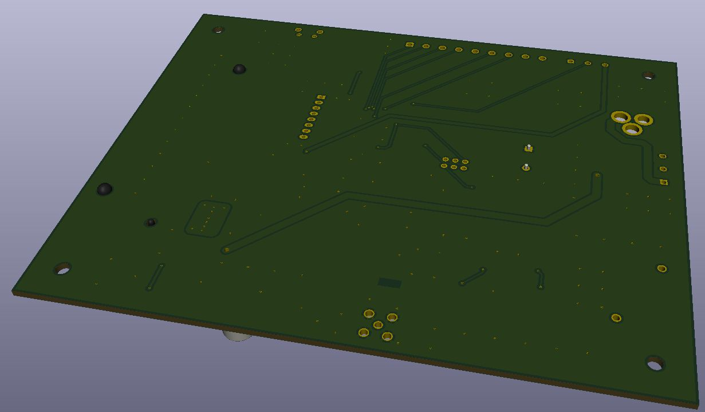

# Project Name
> Gas Warning System (GWS)

## Table of contents
* [General info](#general-info)
* [Screenshots](#screenshots)
* [Technologies](#technologies)
* [Setup](#setup)
* [Features](#features)
* [Status](#status)
* [Inspiration](#inspiration)
* [Parts and footprints list](#Parts-and-footprints-list)
* [Allowed (planned) SMS commands](#Allowed-(planned)-SMS-commands)
* [Principle of operation](#principle-of-operation)
* [Contact](#contact)

## General info
From scratch self-made home alarm system with gas sensor to ensure the safety of residents.
Adaptable system can be modified to gather information from other sensors like flood, carbon monoxide, etc according to residents demends.
System board is powered from the power supply or from battery in case of power failure.
Information about exceed sensor value is send to declared phone number via SMS.

## Screenshots

3D wiew of PCB top side. PCB version 2.1

Real wiew of PCB top side. PCB version 1.0

3D wiew of PCB bottom side. PCB version 2.1

Real wiew of PCB bottom side. PCB version 1.0

View of the ready PCB, version 1.0.

## Technologies
* Arduino 1.8.10 as an IDE
* Arduino Mega 2560 as a testing board
* MQ-2 Gas Sensor
* SIM800C 2G module
* KiCad 5.1.4 as EDA Suite
* freeRouting.jar as an autorouter
* USBASP v2.0 as a target programmer
* AVRdude v6.3

## Setup
In the first step, enter the phone number on line 19 of the Gas_warning_system_v21.ino file to which SMS notifications will be sent. Then prepare the Arduino IDE. To receive long SMS (160 characters) it is needed to extend serials buffer size. To do this in the location:  
"C:\Program Files(x86)\Arduino\hardware\arduino\avr\cores\arduino\HardwareSerial.h  
change buffer size to:  
#define SERIAL_TX_BUFFER_SIZE 254  
#define SERIAL_RX_BUFFER_SIZE 254  

In the next step, you need to compile the code in the Arduino IDE and export it to the .hex format, use the keyboard shortcut Ctrl + Alt + S. The imported files will appear in the folder in which we placed the Gas_warning_system_v21.ino file. We are interested in the Gas_warning_system_v21.ino.mega.hex file, which does not contain a bootloader. This file is uploaded to the microcontroller using the ISP programmer. I use USBAsp in combination with avrdude. If you prefer to use the "windows", I recommend the avrdude graphic overlay called AVRDUDESS 2.11. The Arduino IDE also allows programming of microcontrollers using an external programmer (USBasp), by the way, it uses avrdude. 
Finally, set the fusebits.  

Default ATmega2560 fuses & lock bits:  
L 0x62  
H 0x99  
E 0xFF  
LB 0x3F  

GWS ATmega2560 fuses & lock bits:  
L 0xFF  
H 0xD8  
E 0xFC  
LB 0x3F  
and you can enjoy a working alarm control system.

## Code Examples
{:height="50%" width="50%"}
Screenshot of SMS communication with GWS.

## Features
List of features ready and TODOs for future development
* Adaptable system, 16 additional GPIO ports for future use
* All modules (uC, converters, GSM modem, buffer power supply with battery) on one PCB
* Battery powered system as a backup with protection circuit
* System monitoring by LED indicators and via USB (virtual COM in OS, adjustable baud rate)
* Alarming by SMS, sound (buzzer) and visually
* Reset switch
* In system programming by USBASP 

To-do list:
* Adding USSD code support
* Improving the readability of the code
* Check the program's resistance to incorrectly entered data
* Adding more sensors and appropriate code

## Status
Project is done.

## Inspiration
Project is based on... my need and to refresh my abilities.

## Parts and footprints list

## Allowed SMS commands to Gas Warning System
* Halt - Stops the system
* Start - Starts the system
* Level - Sends an SMS with the current gas level
* Status - Sends an SMS with with the current date, time and gas level
* Account - Account balance (to do)

## Principle of operation

PCB consists of five functional blocks, two DC/DC converters, GSM modem, USB to UART interface, microcontroller with peripherals.
First DC/DC converter (charger) based on TP4056 chip converts 5V DC from the power supply to voltage required by single cell Li-Ion battery (18650 type 2600mAh). The charge voltage is set to 4.2V and the charge current is set by R25 resistor to 1000 mA value. Chip automaticaly terminates the charge cycle when the charge current drops to 1/10th programed value after final float voltage is reached. Batttery is protected from over-discharge and overcharge by DW01A chip. Over-discharge protection - keeps battery from being discharged below 2.4V. Module will cut output power from the battery until the battery voltage has been re-charged above 3.0V. During battery charging TP4056 chip may produce a lot of heat. To dissipate heat a few vias ond copper layer were placed under chip body.

Second converter based on LT1308 is a step-up DC/DC converter. It was design to converts voltage from single Li-Ion to 5V 1A. In Gas Warning System board this voltage is used by USB to UART interface and microcontroller with peripherals blocks.

USB to UART interface is based on well known FT232 chip. It interfaces between USB and Atmega2560 uC UART. In the Windows 10 operating system board is recognised as virtual port (COMx). Driver is installed automaticaly. This feature allows to comunicate with uC from Arduino IDE and monitor Gas Warning System status.

GSM block is based on SIM800C modem. Communication with uC is realized by UART1 (build in the module). AT commands had been succesfully used. Bidirectional logic level conversion was needed to satisfy chips needs. BSS138 transistors had been used to translate between 5V and 4,2V levels. SIM800C is 2G (GSM) generation and uses 900MHz frequency (used in Poland). Three other bands are supported (850, 1800, 1900 MHz) by this module. Transient overvoltage protection has been used to protect ESD component (SIM800C) in signal lines from SIM card.

ATmega2560 is the heart of the system. The same uC is used in Arduino Mega board. uC block is equipped with LEDs, tact switches, buzzer and of course connectors to communicate with sensors like MQ-2 Gas Sensor. Peripherals help user to indicate actual state of the system, do some simple actions or react to alarm. Chip programing is possible via ISP method.

Transistors Q1 and Q3 with neighboring elements perform level conversion between UART (5V) and SIM800C modem (4V). The Q2 circuit is used to enable the SIM800C modem.

## Contact
vacuum.tube.fun@gmail.com
